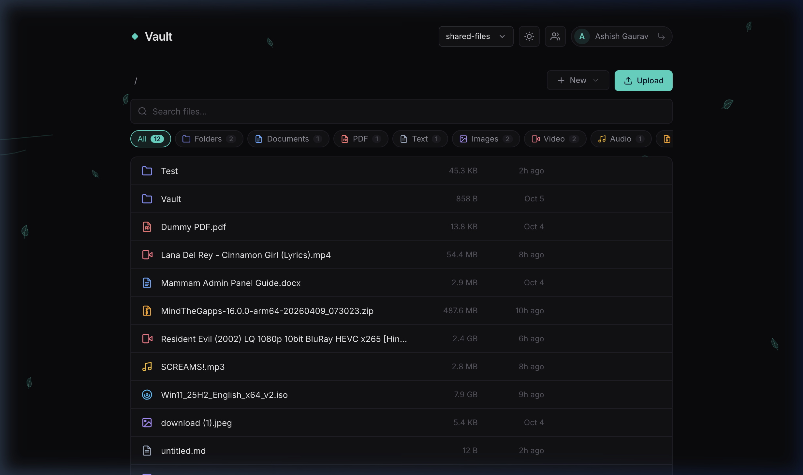
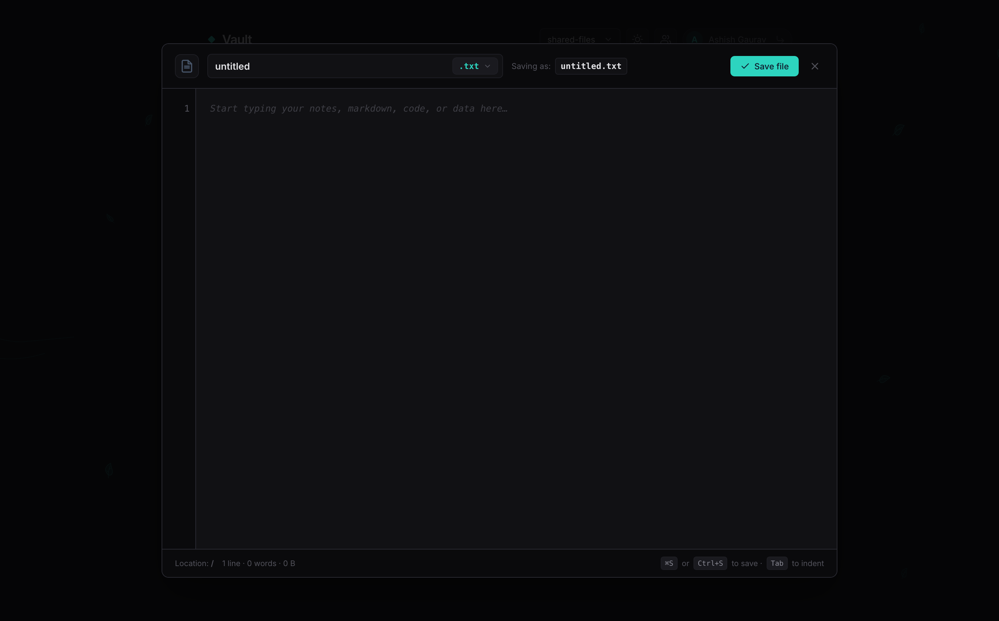
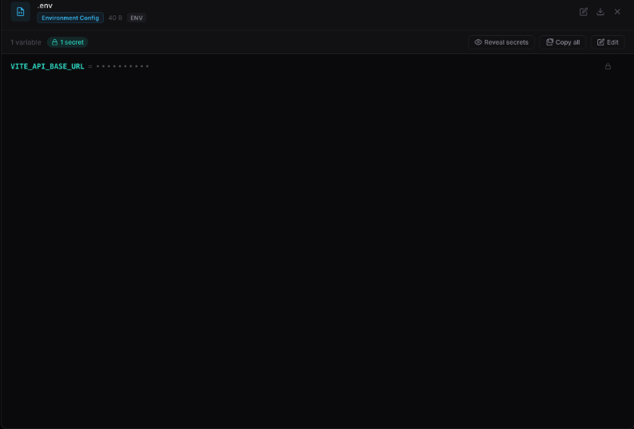
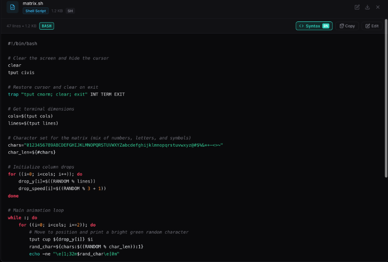
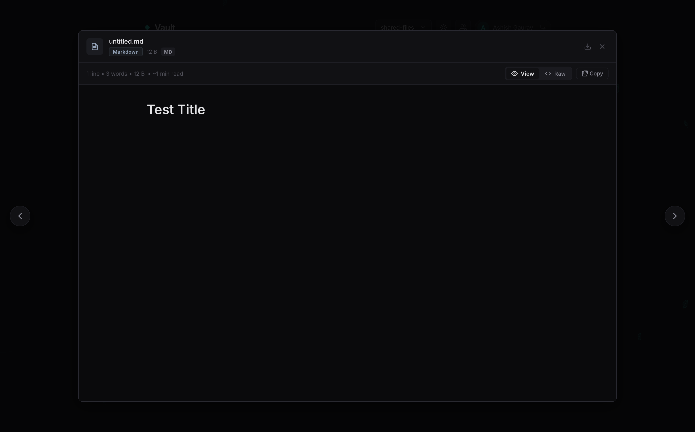
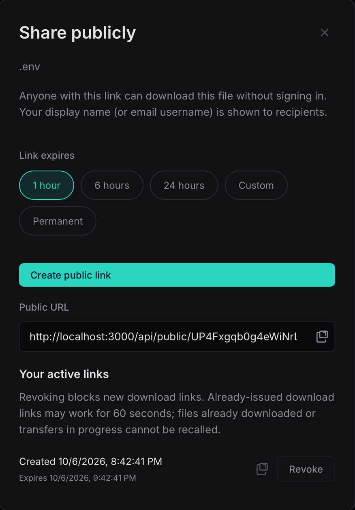
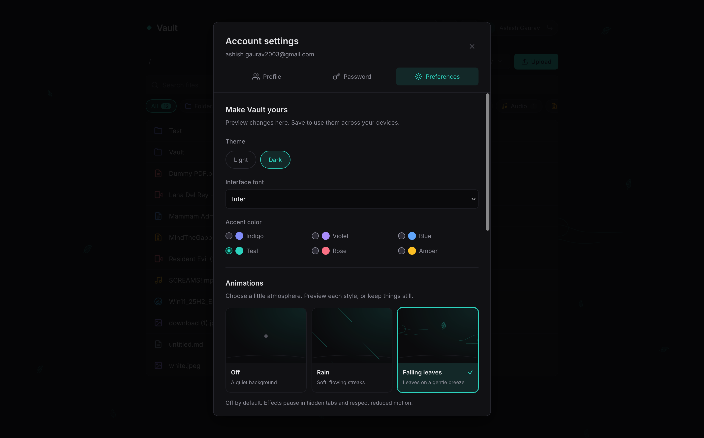
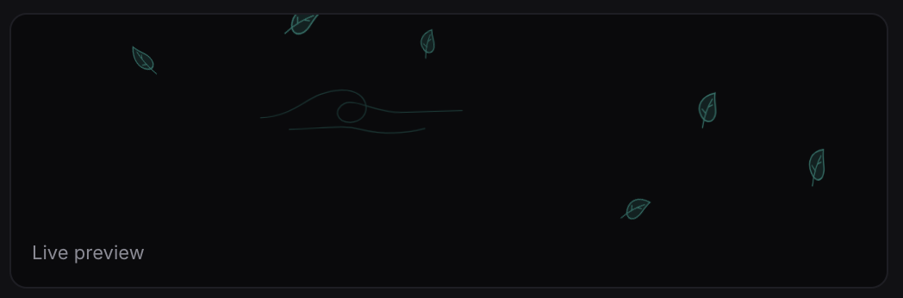
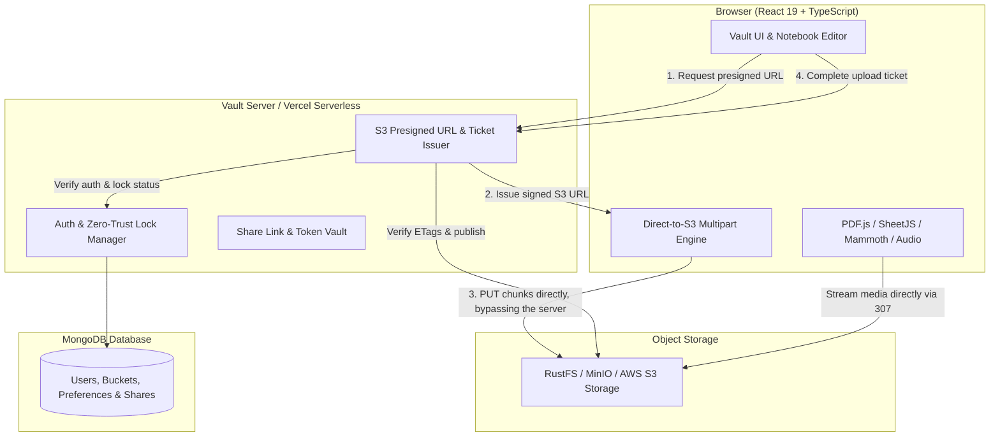

<div align="center">

# Vault — Cloud Workspace & File Manager

**The next-generation, self-hosted cloud storage experience.**  
*Blazing-fast direct S3 uploads, in-browser notebook editing, file sharing, zero-trust private vaults, and instant multi-format previews.*

[](LICENSE)
[](https://nodejs.org/)
[](https://react.dev/)
[](https://www.typescriptlang.org/)
[](https://vitejs.dev/)
[](https://aws.amazon.com/s3/)
[](https://www.mongodb.com/)
[](tests/)
[](https://vercel.com/)

[**Features**](#key-features) • [**Installation**](#installation--quickstart) • [**Customizations**](#appearance--customizations) • [**Deployment**](#deployment-options) • [**Environment**](#environment-variables-reference)

---

</div>

## Why Vault?

Most S3 file managers are clunky administrative consoles built for devops, or sluggish cloud drives that funnel multi-gigabyte uploads through overloaded proxy servers.

**Vault is different.** It combines the polished user experience of a modern desktop operating system with enterprise-grade storage engineering:

- **Zero-Proxy Direct Streaming:** Small and multi-gigabyte files stream directly between the browser and your S3-compatible storage (RustFS, MinIO, Ceph, AWS S3) with no server bottleneck.
- **Built-In Notebook Editor:** Create, draft, and modify `.env`, Markdown, code, and config files directly in the browser with syntax highlighting, line numbers, and instant save.
- **True In-Browser Previews:** View PDFs with a high-DPI canvas reader, preview Word `.docx` and Excel `.xlsx` files, watch videos, stream audio with ID3 album art, and inspect `.env` secrets with automatic masking.
- **Zero-Trust Private Vaults:** Individual password-protected buckets that auto-lock after 15 minutes of inactivity and keep private files hidden from other users and administrators in the app (see the [note](#note) on hardware-level access).

---

## Product Tour & Live Showcase

### 1. Unified Command Center & File Manager

> Manage unlimited buckets, navigate nested directories with instant breadcrumbs, drag-and-drop uploads, and search through thousands of objects with instant filtering.

<div align="center">
  
</div>

> Custom File Type Icons for different types of files

---

### 2. Integrated Notebook Editor (Create & Edit)

> Create brand-new files or edit existing ones directly within Vault. Includes line numbers, 2-space tab indentation, live character/word/byte statistics, format dropdowns, and `⌘S` / `Ctrl+S` keyboard shortcuts with unsaved-changes protection.

<div align="center">
  
</div>

---

### 3. Smart `.env` Secrets Inspector & Code Preview

> Auto-detects sensitive credential keys (`API_KEY`, `SECRET`, `PASSWORD`, `DSN`) and masks them by default (`••••••••••`). Toggle reveal on demand, copy individual values, copy all, or jump straight into the editor.

<div align="center">
  
  
</div>

---

### 4. Rich Markdown & Document Reader

> Renders GitHub-flavored Markdown with formatted tables, code blocks, lists, and links, plus estimated reading times. Toggle between rendered view and raw source in a single click.

<div align="center">
  
</div>

---

### 5. Public Share URLs

> Share files and folders via public URLs with time-limited token access. Revoke access at any time for peace of mind.

<div align="center">
  
</div>

---

## Key Features

| Category | Capability | Highlight |
| :--- | :--- | :--- |
| **High-Speed Transfers** | Direct S3 Client Uploads | Small files use signed PUTs; files larger than 8 MiB use parallel S3 multipart uploads up to 5 TiB. |
| **Upload Monitoring** | Real-Time Telemetry | Rolling speed meter (MB/s), estimated time remaining (ETA), pause/resume, and cancellation. |
| **In-Browser Notebook** | Create & Edit Files | Line-numbered gutter, Tab indentation, live stats, `⌘S` quick save, custom file extensions. |
| **Security & Vaults** | Password-Protected Buckets | Dedicated "Only Me" buckets with bcrypt passwords and 15-minute auto-locking. |
| **Universal Previews** | Document & Media Viewers | High-DPI PDF.js reader, DOCX (Mammoth), XLSX/CSV (SheetJS), video and audio with ID3 covers. |
| **Public Sharing** | Expiring Public Links | Share files or folders with 1-hour to 10-year expiry, bearer tokens, AES-256 encrypted storage, and instant revocation. |
| **Personalization** | Appearance & Particle Engine | Dark/Light themes, curated typography, custom accent colors, and hardware-accelerated CSS rain/leaf effects. |

---

## Appearance & Customizations

Vault treats aesthetics and comfort as first-class citizens. Open **Account Settings → Preferences** to tailor your workspace:

<div align="center">
  
</div>

### Customization Options

- **Theme Modes:** True Dark Mode (high-contrast, deep blacks) and Clean Light Mode.
- **Font Typography:** Switch between curated font stacks (`Inter`, `Outfit`, `Fira Code`, `JetBrains Mono`, `Roboto`, `System`).
- **Accent Palettes:** Tailor the brand glow across Cyan, Indigo, Violet, Rose, Emerald, and Amber.
- **Particle Engine:** An ambient background particle simulation (Rain or Falling Leaves) powered by GPU-accelerated CSS animations:
  - **Direction:** Downward, angled right, or angled left.
  - **Speed:** Adjustable from 0.5× to 2.0×.
  - **Drop Dimensions:** Fine-tune droplet height (12–120 px) and width (1–4 px).
  - **Effects:** Optional water splash impacts along the bottom viewport edge.
  - **Density:** Light (16 particles), Balanced (32), or Full (56), throttled automatically on mobile viewports.

<div align="center">
  
</div>

---

## Architecture & Data Flow

Vault connects your browser directly to your storage infrastructure:



---

## Installation & Quickstart

### Prerequisites

- **Node.js:** 24.x LTS or higher
- **MongoDB:** 7.0+ (local instance or MongoDB Atlas)
- **Object Storage:** Any S3-compatible storage (RustFS, MinIO, AWS S3, Cloudflare R2, Ceph)

### 1. Clone & Install Dependencies

```bash
git clone https://github.com/Fcatilizer/file-manager.git
cd file-manager
npm ci
```

### 2. Configure Environment

Copy the example configuration file:

```bash
cp .env.example .env
```

Generate a secure random JWT secret:

```bash
node -e "console.log(require('crypto').randomBytes(48).toString('hex'))"
```

Update `.env` with your database and storage credentials:

```ini
PORT=3000
NODE_ENV=development

# Database
MONGO_URI=mongodb://localhost:27017/vault
MONGO_DB=vault
JWT_SECRET=your_generated_random_secret_here

# Object Storage (RustFS / MinIO / S3)
MINIO_ENDPOINT=http://localhost:9000
MINIO_PUBLIC_ENDPOINT=http://localhost:9000
MINIO_ACCESS_KEY=your_minio_access_key
MINIO_SECRET_KEY=your_minio_secret_key
MINIO_BUCKET=public-files
MINIO_PRIVATE_BUCKET=shared-files
MINIO_REGION=us-east-1

# Optional: Initial Administrator (the setup wizard at /setup runs if omitted)
ADMIN_EMAIL=admin@example.com
ADMIN_PASSWORD=change_this_secure_password
```

### 3. Launch the Development Server

```bash
npm run dev
```

Open [http://localhost:3000](http://localhost:3000) in your browser.

---

## 🚢 Deployment Options

Vault can be deployed as a **Docker container**, a standard **Node.js persistent process**, or a **Vercel serverless application**.

### Option A: Docker (Recommended for Production)

A multi-stage production `Dockerfile` is included:

```bash
# Build the optimized production image
docker build -t vault-file-manager .

# Run the container with your environment configuration
docker run -d \
  --name vault \
  -p 3000:3000 \
  --env-file .env \
  --restart unless-stopped \
  vault-file-manager
```

### Option B: Node.js Host (Render / Railway / VPS)

```bash
# Compile the client bundle and serverless entry
npm run build

# Start the production server
npm start
```

### Option C: Vercel Serverless Function

Vault includes built-in Vercel configuration (`vercel.json` and the `server/vercel.ts` adapter):

1. Import the repository into your [Vercel Dashboard](https://vercel.com).
2. Set the environment variables in the Vercel project settings (`MONGO_URI`, `JWT_SECRET`, `MINIO_ENDPOINT`, `MINIO_ACCESS_KEY`, etc.).
3. **Configure RustFS/MinIO CORS:** Add your deployed Vercel domain to your storage server's CORS settings so the browser can perform direct PUT requests:

   ```env
   RUSTFS_CORS_ALLOWED_ORIGINS="https://your-vault-app.vercel.app"
   ```

4. Verify CORS readiness:

   ```bash
   curl -i -X OPTIONS 'https://your-storage-api.com/bucket/cors-check' \
     -H 'Origin: https://your-vault-app.vercel.app' \
     -H 'Access-Control-Request-Method: PUT' \
     -H 'Access-Control-Request-Headers: content-type'
   ```

5. Click **Deploy**.

---

## Environment Variables Reference

| Variable | Required | Default | Description |
| :--- | :---: | :---: | :--- |
| `MONGO_URI` | **Yes** | — | MongoDB connection string (e.g. `mongodb+srv://...`) |
| `MONGO_DB` | No | `vault` | Database name |
| `JWT_SECRET` | **Yes** (prod) | — | Cryptographically random string for session tokens |
| `SHARE_TOKEN_SECRET` | No | `JWT_SECRET` | Secret used to encrypt public share link tokens with AES-256-GCM |
| `SESSION_TTL` | No | `7d` | User session duration |
| `ADMIN_EMAIL` | No | — | Seeds the default administrator account |
| `ADMIN_PASSWORD` | No | — | Seeds the default administrator password |
| `SETUP_TOKEN` | No | — | Optional token required during the first-run `/setup` wizard |
| `MINIO_ENDPOINT` | **Yes** | — | S3/RustFS endpoint URL for server operations |
| `MINIO_PUBLIC_ENDPOINT` | No | `MINIO_ENDPOINT` | Browser-reachable HTTPS URL for client presigned uploads |
| `MINIO_ACCESS_KEY` | **Yes** | — | S3 storage access key |
| `MINIO_SECRET_KEY` | **Yes** | — | S3 storage secret key |
| `MINIO_BUCKET` | No | `public-files` | Default shared bucket name |
| `MINIO_PRIVATE_BUCKET` | No | `shared-files` | Default private bucket selection |
| `MINIO_REGION` | No | `us-east-1` | S3 region identifier |
| `PORT` | No | `3000` | Port for the HTTP server |
| `HOST` | No | `0.0.0.0` | Bind host address |

---

## Testing & Code Quality

```bash
# Run the unit & integration test suite (122 tests)
npm test

# Check code formatting & lint rules
npm run lint

# Compile TypeScript and production client/server bundles
npm run build
```

---

## Note

> [!NOTE]
> Vault does not guarantee encryption of files and folders at the hardware level. The person hosting the storage may still be able to read all bucket contents directly from the drives.

Vault is intended for managing your own files in a bucket you host yourself, shared among family and friends.

> [!TIP]
> This is a work in progress. Features are added and removed frequently.Suggestion for improvents are appreceated.

> [Developer Note]
> This project i've started to be able to share files with my family and friends. I wanted to have full control over my data and also have full control over who can access my data. I think this project achieves both of these goals.

> This project was based on an idea of simple file manager + modern UI and some extra features that i wanted to have in a file manager.

---

## License

Vault is open-source software licensed under the **[MIT License](LICENSE)**.